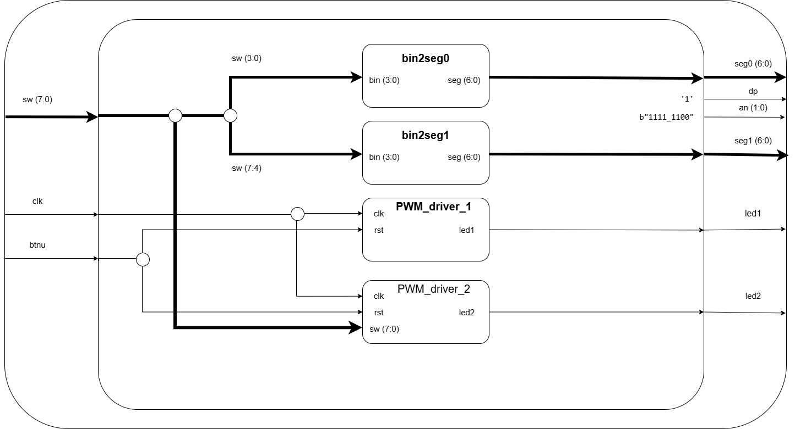

# PWM_breathing_LED
Zadání: Řízení dýchání LED pomocí pulsní šířkové modulace v trojúhelníkovém signálu, k projektu dále patří rozšíření, které obsahuje: řízení duty cyklu druhé LED pomocí switchů a hexadecimální zobrazení aktuálního nastavení na dva sedmisegmentové displeje. 

**Bloková schémata:**

**Tabulka pro top:**
|  IN      |  OUT     |
|    ---   |    ---   |
| CLK      | LED1     |
| RST      | LED2     |
| SW(7:0)  | Seg0(6:0)|
|          | Seg1(6:0)|
|          | dp       |
|          | an       |

**Tabulka pro driver1:**
|  IN      |  OUT     |
|    ---   |    ---   |
| CLK      | LED1     |
| RST      |          |

**Tabulka pro driver2:**
|  IN      |  OUT     |
|    ---   |    ---   |
| CLK      | LED1     |
| RST      |  LED2    |
| CNT      |          |

