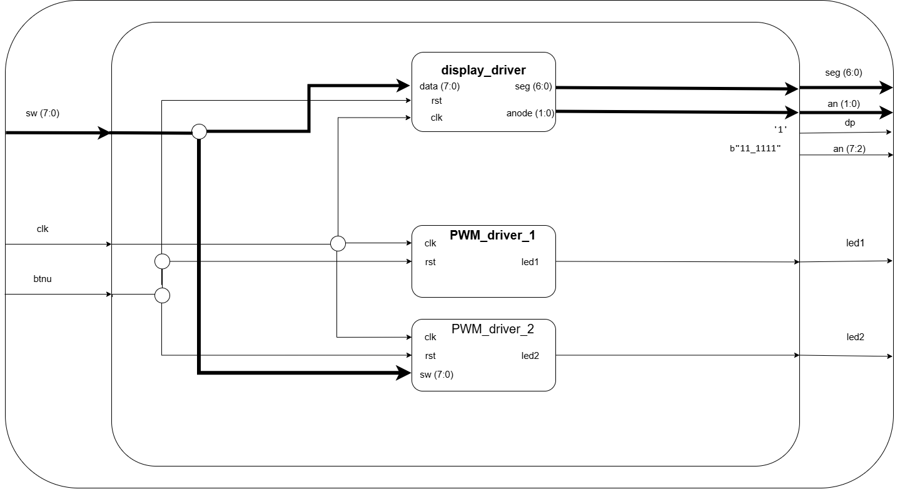
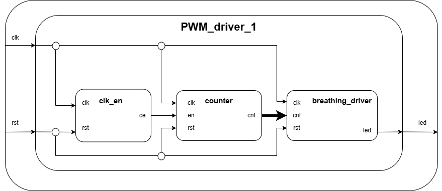
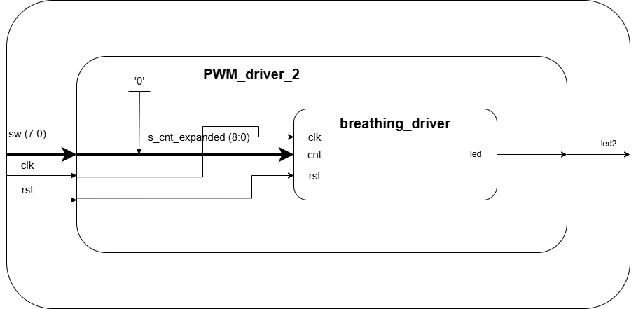
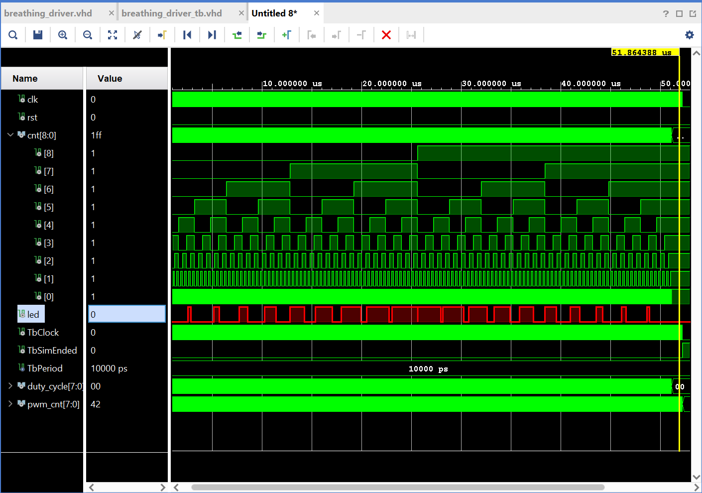
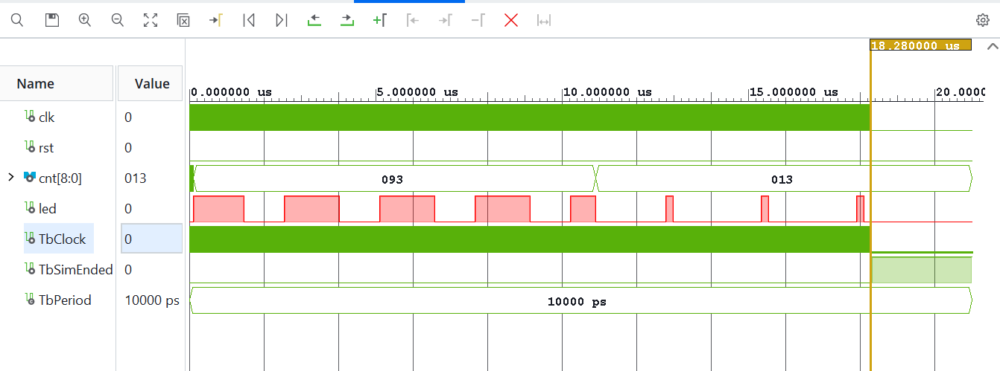
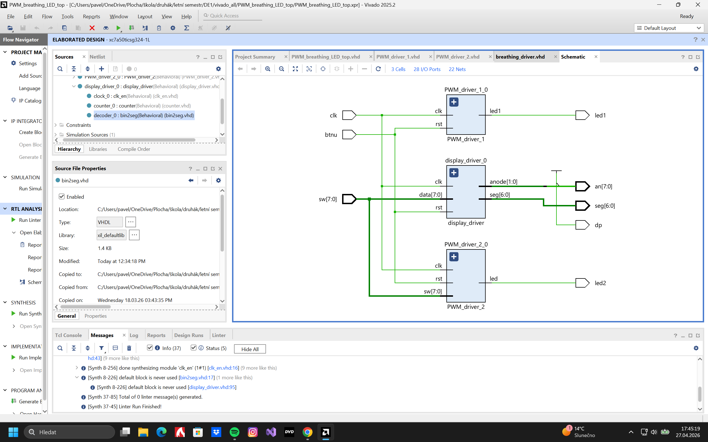

# PWM_breathing_LED
### Zadání 
Řízení dýchání LED pomocí pulsní šířkové modulace, k projektu dále patří rozšíření, které obsahuje: řízení duty cyklu druhé LED pomocí switchů a hexadecimální zobrazení aktuálního nastavení na dva sedmisegmentové displeje. 

-Jádrem řešení je modul ***breathing_driver***, který na základě devítibitového vstupního logického vektoru generuje výsledný PWM signál, klíčovým prvkem je využití MSB jako přepínače směru jasu, kdy při logické nule jas lineárně narůstá a při logické jedničce začne vnitřní logika zbývajících 8 bitů invertovat, čímž vytváří plynulý efekt zhasínání.

Zatímco v prvním kanálu ***PWM_driver_1*** je tento proces automatizován pomocí ***countr*** a ***clk_en*** pro dosažení cyklického dýchání, druhý kanál ***PWM_driver_2*** využívá stejnou logiku pro statické nastavení jasu, kde je nejvyšší bit pevně uzemněn a zbylých 8 bitů je přímo řízeno mechanickými přepínači.

## **Bloková schémata:**

### PWM_Breathing_LED: TOP modul 

**Tabulka pro TOP model:**
| Jméno portu | Směr | Typ |
| :---: | :---: | :--- |
| `clk` | in | `std_logic` |
| `rst` | in | `std_logic` |
| `btnu` | in | `std_logic` |
| `seg` | out | `std_logic_vector(6 downto 0)` |
| `an` | out | `std_logic_vector(7 downto 0)` |
| `dp` | out | `std_logic` |
| `led1` | out | `std_logic` |
| `led2` | out | `std_logic` |

### PWM_Driver_1: zajišťuje chod dýchaní LED1

**Tabulka pro PWM_driver1:**
| Jméno portu | Směr | Typ |
| :---: | :---: | :--- |
| `clk` | in | `std_logic` |
| `rst` | in | `std_logic` |
| `led` | out | `std_logic` |

Jako první modul je ***clock enable***, která z hlavního hodinový signálu `clk` generuje úzké pulzy na svém výstupu `ce` s menší frekvencí. Tento výstup `ce` následně ovlivňuje rychlost čítání v modulu ***counter***, který počítá od 0 do maxima (512) a poté zpět od 0. Každou další hodnotu přičíta v momentě kdy `ce` je aktivní. Z výstupu ***counteru*** `cnt`, na kterém je logický vektor aktuálního stavu ***counter***, probíhá řízení posledního bloku ***breathing_driver***. Tento model v sobě uvnitř dělá to, že porovnává jas který má v sobě s `cnt` průběhem. Výsledkem potom je PWM signál, jehož střída se plynule mění v čase, což vytváří vizuální efekt dýchání.     

### PWM_Driver_2: zajišťuje statický jas LED2

**Tabulka pro driver2:**
| Jméno portu | Směr | Typ |
| :---: | :---: | :--- |
| `clk` | in | `std_logic` |
| `rst` | in | `std_logic` |
| `sw` | in | `std_logic_vector(7 downto 0)` |
| `led` | out | `std_logic` |

Tento druhý driver ovládá druhou LEDku a to za pomocí switchů, které jsou na desce. Každý switch představuje 1 bit, který je buďto v režimu 0 (off) nebo 1 (on). Tyto bity dohromady budou určovat střídu PWM signálu. Díky tomu budeme ovládat jas LEDky a to pomocí toho, že v jedné periodě bude LEDka buďto více svítit nebo bude více zhasnutá, což právě bude mít na starost střída signálu. Tento efekt bude ve výsledku vypadat že LEDka bude právě pomocí switchů měnit svůj jas.

## **Simulace**

### Breathing Driver

### Driver 2

## **Schéma VHDL**

